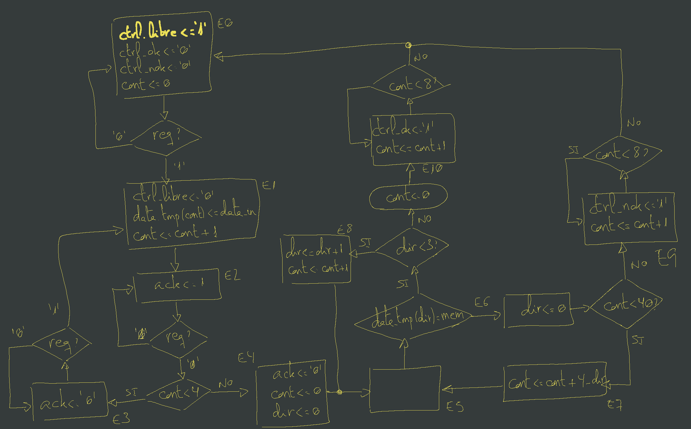

# Hardware Defender VHDL
## Introducción

El objetivo de este proyecto es implementar protecciones para un sistema de verificación de claves implementado en VHDL. 

El sistema original consiste en una máquina de estados que, tras recibir la clave introducida por el usuario, va comparando la misma con las claves almacenadas en la memoria, hasta encontrar una coincidencia o terminar de leer dicha memoria. La clave está compuesto por 4 dígitos.

La clave se compara dígito a dígito, dando por válida la clave una vez coincidan todos sus dígitos con los de una de las claves almacenadas en memoria

## Máquina de estados

La máquina de estados original es la siguiente:

## Vulnerabilidades de la implementación original

En la implementación original, la comparación de la clave con cada una de las almacenadas en memoria se interrumpe una vez se comprueba que uno de los dígitos no coincide. Esto provoca que, en los casos de no coincidencia, los tiempos sean diferentes en función del número de dígitos acertados.

Lo cual, mediante un análisis de señales, se podría utilizar para detectar el número de dígitos acertados y así, de esta manera, ir adivinando la clave dígito a dígito. 

Además, las claves en la memoria se almacenan en texto plano, lo cual podría dar lugar a que una lectura ilegítima de la memoria expusiera todas sus claves. 

La memoria está inicializada a 0, por lo que el atacante podría encontrar las claves simplemente leyendo las posiciones no nulas. Y, finalmente, las claves siempre se empiezan a comprobar desde el inicio de la memoria, por lo que el atacante sabría siempre por donde empezar a buscar.

## Implementaciones

El sistema dispone de dos implementaciones: una cableada, cuya máquina de estados se implementa directamente en VHDL; y otra programada, que está implementada sobre un microcontrolador Picoblaze embebido en el propio diseño hardware, mediante una rutina ensamblador.

El diseño del sistema permite elegir entre una implementación u otra, modificando un par de líneas de código

## Mitigaciones

### Vulnerabilidad de búsqueda de clave por medición de tiempos

La mitigación para esta vulnerabilidad es simple: hay que conseguir que, ante una clave errónea, el sistema tarde siempre el mismo tiempo en activar la señal de "clave incorrecta". Idealmente, también se pueden equiparar los tiempos de las señales de "correcto" e "incorrecto"

#### Implementación cableada

En esta implementación, la mitigación para la vulnerabilidad de la medición de tiempos se ha hecho mediante un [contador adicional](https://github.com/AlmuHS/ProyectoAtaquesHW/blob/master/M%C3%B3dulos/ing_inv_cableada.vhd#L48), el cual, ante un dígito erróneo, realiza una espera de tantos ciclos como serían necesarios para leer el resto.

Para esconder la espera, se ha añadido [dentro del mismo estado E5](https://github.com/AlmuHS/ProyectoAtaquesHW/blob/master/M%C3%B3dulos/ing_inv_cableada.vhd#L143-L151), correspondiente a la lectura de los dígitos, mediante una condición que permite diferenciar entre ambas situaciones

#### Implementación programada

En la implementación programada, dado que el cálculo del número de ciclos es extremadamente complicado, lo que hemos hecho es forzar a que siempre se lean todos los dígitos y toda la memoria, independientemente del número de dígitos correctos e incluso de que la clave sea correcta.

Para saber si la clave es correcta, en lugar de terminar la ejecución al encontrarla o de detener la lectura de la combinación al encontrar un error, lo que hacemos es añadir [dos flags](https://github.com/AlmuHS/ProyectoAtaquesHW/blob/master/M%C3%B3dulos/ing_inv_sw.psm#L23-L24): uno que indique si en la combinación actual hay algún error, y otro que indique si se ha encontrado alguna clave correcta.

Al encontrar un error en la combinación, [activamos el flag de error](https://github.com/AlmuHS/ProyectoAtaquesHW/blob/master/M%C3%B3dulos/ing_inv_sw.psm#L139). Al terminar la lectura de la combinación, si el flag de error no está activo, [activamos el flag de clave correcta](https://github.com/AlmuHS/ProyectoAtaquesHW/blob/master/M%C3%B3dulos/ing_inv_sw.psm#L206). 

Al terminar la lectura de la memoria, [comprobamos el flag de clave correcta](https://github.com/AlmuHS/ProyectoAtaquesHW/blob/master/M%C3%B3dulos/ing_inv_sw.psm#L211) para saber si se ha encontrado alguna coincidencia.

### Lectura de la memoria

Para solucionar el problema de la lectura de las claves desde la memoria, realizamos dos acciones:

1. **Completado de la memoria con información aleatoria:** Esto complica el poder encontrar las claves mediante la búsqueda de posiciones de memoria no nulas

2. **Cifrado de la memoria: ** Esto obliga a utilizar un algoritmo de decodificación para poder descifrar las claves  

3. **Inicio de la lectura de las claves en una posición diferente al inicio de la memoria: ** Esto hará mas difícil encontrar la ubicación de las claves a descifrar

#### Rellenado de la memoria con información aleatoria

* Para generar la información aleatoria, utilizamos un [script de Python](https://github.com/AlmuHS/ProyectoAtaquesHW/blob/master/gen_random_mem.py) que, mediante el módulo "secrets", genera números con un grado de aleatoriedad suficiente para utilizarse en claves. El script, utilizando dicho módulo, genera un conjunto de líneas con datos aleatorios en el mismo formato que requerimos para rellenar la memoria dentro de nuestro código.

* Hecho esto, simplemente [reemplazamos la memoria original](https://github.com/AlmuHS/ProyectoAtaquesHW/blob/master/M%C3%B3dulos/sistema_clave.vhd#L108-L174) por la obtenida por el script.

#### Cifrado de la memoria

Para el cifrado de la memoria, como algoritmo sencillo, utilizamos un complemento a 2 "en positivo", calculando, para cada dígito (2^4 - valor).

En realidad, la memoria se asume cifrada ya de serie, por lo que el algoritmo se utilizaría únicamente para decodificar los valores ya existentes.

En el caso de la implementación cableada, la decodificación se implementa en una [función](https://github.com/AlmuHS/ProyectoAtaquesHW/blob/master/M%C3%B3dulos/ing_inv_cableada.vhd#L57-L66), para ocultarla de forma menos evidente que con un componente adicional.

En la implementación programada, la [decodificación](https://github.com/AlmuHS/ProyectoAtaquesHW/blob/master/M%C3%B3dulos/ing_inv_sw.psm#L115-L117) se realiza durante la comprobación de la clave, dentro de la propia rutina ensamblador

#### Inicio de la lectura en una posición diferente al inicio de la memoria

##### Implementación cableada

Para realizar esto, en la versión cableada, [modificamos el contador de lectura de la memoria](https://github.com/AlmuHS/ProyectoAtaquesHW/commit/b823feb0ee4632dd08783a3e2919d0dd2d841e84) para que, al valor indicado en la máquina de estados, le sume el desplazamiento. El desplazamiento inicia la lectura en la posición situada aproximadamente en la mitad de la fila 19 del código.

##### Implementación programada

En la implementación programada, la lectura de la memoria utiliza direcciones de 10 bits, por lo que la posición indicada en la implementación cableada sería inalcanzable. Por esta razón, [deshicimos los cambios de la implementación cableada](https://github.com/AlmuHS/ProyectoAtaquesHW/blob/master/M%C3%B3dulos/sistema_clave.vhd#L99), y aplicamos el desplazamiento dentro del propio código ensamblador.

La lectura comienza en una posición posterior al inicio, pero anterior a la utilizada en la versión cableada

## Ficheros

### Ficheros principales

- [sistema_clave.vhd](https://github.com/AlmuHS/ProyectoAtaquesHW/blob/master/M%C3%B3dulos/sistema_clave.vhd): Fichero principal, que alberga los componentes de las implementaciones cableada y programada, y la memoria de claves común para los mismos.  

	La implementación a sintetizar se puede seleccionar [descomentando el port map correspondiente](https://github.com/AlmuHS/ProyectoAtaquesHW/blob/master/M%C3%B3dulos/sistema_clave.vhd#L74-L97)

- [sistema_clave_tb.vhd](https://github.com/AlmuHS/ProyectoAtaquesHW/blob/master/M%C3%B3dulos/sistema_clave_tb.vhd): Fichero de simulación del sistema completo

### Implementación cableada

- [ing_inv_cableada.vhd](https://github.com/AlmuHS/ProyectoAtaquesHW/blob/master/M%C3%B3dulos/ing_inv_cableada.vhd): Implementación de la máquina de estados en versión cableada  

- [ing_inv_cableada_tb.vhd](https://github.com/AlmuHS/ProyectoAtaquesHW/blob/master/M%C3%B3dulos/ing_inv_cableada_tb.vhd): Fichero de simulación para el sistema cableado

#### Implementación programada

- [ing_inv_programada.vhd](https://github.com/AlmuHS/ProyectoAtaquesHW/blob/master/M%C3%B3dulos/ing_inv_programada.vhd): Fichero de conexión del sistema programado con Picoblaze

- [ing_inv_sw.psm](https://github.com/AlmuHS/ProyectoAtaquesHW/blob/master/M%C3%B3dulos/ing_inv_sw.psm): Rutina ensamblador para picoblaze

- [prog.vhd](https://github.com/AlmuHS/ProyectoAtaquesHW/blob/master/M%C3%B3dulos/prog.vhd): Fichero de programación de Picoblaze, con la rutina ensamblador almacenada en memoria

- [prog_sim.vhd](https://github.com/AlmuHS/ProyectoAtaquesHW/blob/master/M%C3%B3dulos/prog_sim.vhd): Fichero de simulación del sistema implementado en Picoblaze

##### Picoblaze

- [puertos_in.vhd](https://github.com/AlmuHS/ProyectoAtaquesHW/blob/master/Picoblaze/puertos_in.vhd): Fichero de conexión de los puertos de entrada de nuestro proyecto para Picoblaze

- [puertos_out.vhd](https://github.com/AlmuHS/ProyectoAtaquesHW/blob/master/Picoblaze/puertos_out.vhd): Fichero de conexión de los puertos de salida con Picoblaze

- [picoblaze_pkg.vhd](https://github.com/AlmuHS/ProyectoAtaquesHW/blob/master/Picoblaze/picoblaze_pkg.vhd): Fichero de definición de los puertos de entrada y salida dentro de Picoblaze

- [interrupcion_pblaze.vhd](https://github.com/AlmuHS/ProyectoAtaquesHW/blob/master/Picoblaze/interrupcion_pblaze.vhd): Fichero de definición de las interrupciones para Picoblaze

#### Auxiliares

- [gen_random_mem.py](https://github.com/AlmuHS/ProyectoAtaquesHW/blob/master/gen_random_mem.py): Script de Python para generar la memoria aleatoria del sistema

